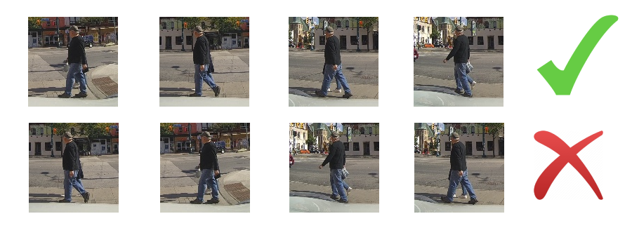
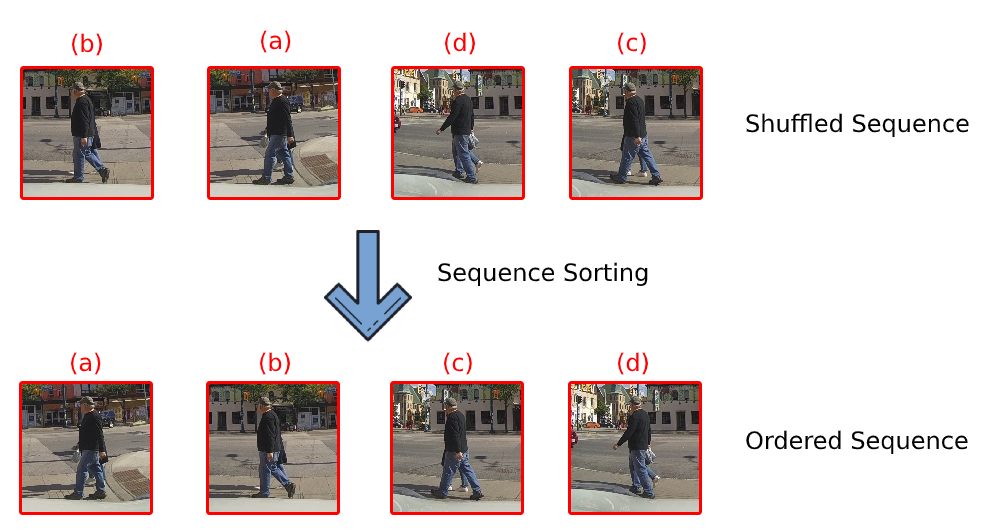

# PedestrianRecognition
### Description
PedestrianRecognition is a software that obstains and evaluates models that solve the task of recognition of crossing action through self-supervised learning techniques. The self-supervised methods implemented are:
- __Temporal order verification__: verify whether a sequence of input frames is in correct temporal order.

  

- __Temporal order recognition__: recognize the order of a sequence of input frames.

  


# Required software and libraries

- Ubuntu 18.04 OR 16.04 LTS
- Python 3.6
- CUDA 10.1
- cuDNN 7.6
- TensorRT 6.0
- Tensorflow 2.2.0
- Keras 2.3.0

To install the rest of the libraries, follow these steps:

```bash
# Repository files
$ git clone git@github.com:YorYYi/PedestrianRecognition.git
$ cd PedestrianRecognition/

#Create virtual environment
$ python -m venv virtual_environmment_path/virtual_environmment_name

#Activate virtual environment
$ source virtual_environmment_path/virtual_environmment_name

# Install requirements
$ pip install -r requirements.txt
```

# Download dataset

The dataset must be downloaded from the following [webside](http://data.nvision2.eecs.yorku.ca/PIE_dataset/PIE_clips/). Also following the [repository](https://github.com/aras62/PIE) instructions, the data file must be generated with the information of the notations necessary for the generation of the instances.


# Create instances

To create the instances with which the models are trained, the following repository scripts must be executed. 


```bash
$ python utilities/create_instances_PIE_CrossingDetection.py
$ python utilities/create_instances_PIE_OrderPrediction.py
```

Through the configuration file, the values of the following parameters must be provided for both scripts:
- **input_path_data**: path where the file with the dataset information is located.
- **input_path_dataset**: path where the downloaded dataset is located.
- **output_path_frames**: base path where you want to sotre the cuts frames from the dataset.
- **output_path_instances**: base path where the created instances will be stored.
- **output_path_cuts**: base path where you want to stored the summaries of the frames in order to view them.
- **optical_flow**: frames summary type.


# Create train, validation and test

The following script is sued to create the training, validation and test datasets:

```bash
$ python utilities/create_train_validation_test.py
```

Through the configuration file, the values of the following parameters must be provided:
- **path_instances**: path where the file with the information of the data set instances is located. It is located in the data folder of the repository.
- **path_output**: folder where the text files containing the train, validation and test instances will be stored.


# Example of use. Temporal order verification

First, the hyperparameters of the models that solve the pretext tasks must be optimized. For this the following script is executed:

```bash
$ python Hyperparameters_Optimization_Pretexts_Tasks/Shuffle/Hyperparameters_Optimization_Shuffle.py
```

Through the configuration file, the values of the following parameters must be provided:

- **data_sampling**: frames summary type.
- **path_instance**: it corresponds to the value of the parameters **output_path_instances** indicated in the script **create_instances_PIE_CrossingDetection.py**.
- **path_id_instances**: it corresponds to the value of the parameters **path_output** indicated in the script **create_train_validation_test.py**.
- **path_dir_results**: base path where hyperparameters tuning trials are stored.
- **path_hyperparameters**: base path where the best hyperparameters are stored.
- **project_name**: name of the hyperparameters optimization project.
